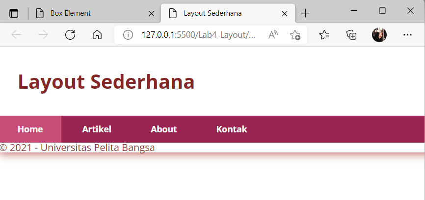
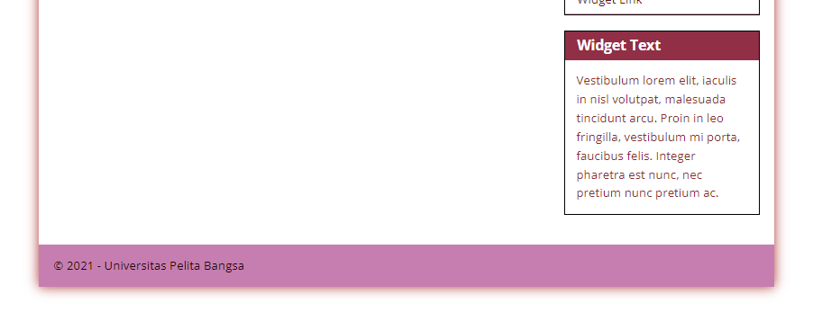

# PEMOGRAMAAN WEB

Diyan Arum Maheswari (312010133)

Teknik Informatika - UNIVERSITAS PELITA BANGSA
______________________________________________

## MEMBUAT BOX ELEMENT

Pertama, disini saya akan membuat sebuah dokumen dasar Htmlnya terlebih dahulu, sebelum nantinya akan saya tambahkan kode untuk membuat sebuah Box Element.


Berikut codingan yang saya gunakan untuk membuat sebuah dokumen dasar dengan judul Box Element dari Html.

```html
<!DOCTYPE html>
<html lang="en">
<head>
    <meta charset="UTF-8">
    <meta name="viewport" content="width=device-width, initial-scale=1.0">
    <title> Element</title>
</head>
<body>
    <header>
        <h1>Box Element</h1>
    </header>
</body>
</html>    
```

Setelah membuat dasarnya seperti diatas, selanjutnya tambahkan sebuah kode untuk membuat Box Element dengan tag div seperti dibawah ini:


Dengan menggunakan kode berikut:

```html
<section>
    <div class="div1">Div 1</div>
    <div class="div2">Div 2</div>
    <div class="div3">Div 3</div>
</section>
```


Dan jika kalian ingin divnya lebih berwarna atau lebih bervariasi lagi seperti gambar diatas, kalian dapat menggunakan kode dibawah ini pada bagian headnya untuk membuat sebuah deklarasi CSS Float Property.

```html
<style>
    div {
        float:left;
        padding: 10px;
    }
    .div1 {
        background: rgb(237, 160, 176);
    }
    .div2 {
        background: rgb(210, 100, 135);
    }
    .div3 {
        background: rgb(170, 54, 100);
    }
</style>
```

## PENGATURAN CLEARFIX ELEMENT

Setelah membuat Box Element dengan tag div yang sudah di variasikan, selajutnya yang akan kita lakukan yaitu melakukan Clearfix atau pengaturan lanjutan untuk Box Element yang sebelumnya sudah dilakukan Float Element seperti diatas dengan menambahkan div lainnya setelah Div3 seperti berikut.

```html
<section>
    <div class="div1">Div 1</div>
    <div class="div2">Div 2</div>
    <div class="div3">Div 3</div>
    <div class="div4">Div 4</div>
</section>
```


Kemudian untuk mengaturnya menjadi seperti gambar diatas, kalian dapat memasukan kode berikut:

```html
.div4 {
        background-color: rgb(180, 146, 176);
        clear: left;
        float: none;
    }
```

## MEMBUAT LAYOUT SEDERHANA

Untuk dapat membuat sebuah Layout Sederhana, langkah awal yang perlu dilakuan ialah membuat sebuah sebuah folder baru yang kemudian didalamnya terdapat sebuah file baru berbasis html dan juga css.


Berikut kode yang saya gunakan untuk membuat folder baru tersebut yang nantinya akan nampak seperti gambar diatas.

```html
<!DOCTYPE html>
<html lang="en">

<head>
    <meta charset="UTF-8">
    <meta name="viewport" content="width=device-width, initial-scale=1.0">
    <title>Layout Sederhana</title>
    <link rel="stylesheet" href="style.css">
</head>
<body>
    <div id="container">
        <header>
            <h1>Layout Sederhana</h1>
        </header>
        <nav>
            <a href="home.html" class="active">Home</a>
            <a href="artikel.html">Artikel</a>
            <a href="about.html">About</a>
            <a href="kontak.html">Kontak</a>
        </nav>
        <section id="hero"></section>
        <section id="wrapper">
            <section id="main"></section>
            <aside id="sidebar"></aside>
        </section>
        <footer>
            <p>&copy; 2021 - Universitas Pelita Bangsa</p>
        </footer>
    </div>
</body>
</html>
```


Setelahnya, kalian dapat menambahkan kode lainnya pada file CSS untuk dapat membuat layout diatas dengan kode berikut:

```css
/* import google font */
@import
url('https://fonts.googleapis.com/css2?family=Open+Sans:ital,wght@0,300;0,400;0,600;0,700;0,800;1,300;1,400;1,600;1,700;1,800&display=swap');
@import
url('https://fonts.googleapis.com/css2?family=Open+Sans+Condensed:ital,wght@0,300;0,700;1,300&display=swap');

/* Reset CSS */
* {
    margin: 0;
    padding: 0;
}
body {
    line-height:1;
    font-size:100%;
    font-family:'Open Sans', sans-serif;
    color:#8c2d2d;
}
#container {
    width: 980px;
    margin: 0 auto;
    box-shadow: 0 0 1em #ac3331;
}
    
/* header */
header {
    padding: 20px;
}
header h1 {
    margin: 20px 10px;
    color: #842626;
}
```

## MEMBUAT NAVIGASI



Untuk dapat melakukan sebuah pengaturan navigasi seperti diatas kalian dapat menambahkan kode berikut pada file CSS sebelumnya.

```css
/* navigasi */
nav {
    display: block;
    background-color: #9a2451;
}
nav a {
    padding: 15px 30px;
    display: inline-block;
    color: #ffffff;
    font-size: 14px;
    text-decoration: none;
    font-weight: bold;
}
nav a.active,
nav a:hover {
    background-color: #c64e78;
}
```

## PEMBUATAN HERO PANEL


Dalam pembuatan Hero Panel kalian perlu memasukan kode Html dan juga CSS seperti berikut ini:

```html
<section id="hero">
    <h1>Hello World!</h1>
    <p>Lorem ipsum dolor sit amet, consectetur adipiscing elit. Vestibulum lorem
elit, iaculis innisl volutpat, malesuada tincidunt arcu. Proin in leo fringilla,
vestibulum mi porta, faucibus felis. Integer pharetra est nunc, nec pretium nunc
pretium ac.</p>
    <a href="home.html" class="btn btn-large">Learn more &raquo;</a>
</section>
```

```css
/* Hero Panel */
#hero {
    background-color: #f0d3de;
    padding: 50px 20px;
    margin-bottom: 20px;
}
#hero h1 {
    margin-bottom: 20px;
    font-size: 35px;
}
#hero p {
    margin-bottom: 20px;
    font-size: 18px;
    line-height: 25px;
}
```


## PENGATURAN LAYOUT MAIN DAN SIDEBAR

 Selanjutnya, melakukan sebuah pengaturan main content dan sidebar, dengan menambahkan kode CSS float berikut ini:

 ```css
 /* main content */
#wrapper {
    margin: 0;
}
#main {
    float: left;
    width: 640px;
    padding: 20px;
}

/* sidebar area */
#sidebar {
    float: left;
    width: 260px;
    padding: 20px;
}
```

## PEMBUATAN SIDEBAR WIDGET


Untuk menambahkan element lain dalam sidebar dan sebuah Widget CSS seperti gambar diatas, kalian dapat menggunakan kode berikut:

```html
<aside id="sidebar">
    <div class="widget-box">
        <h3 class="title">Widget Header</h3>
        <ul>
            <li><a href="#">Widget Link</a></li>
            <li><a href="#">Widget Link</a></li>
            <li><a href="#">Widget Link</a></li>
            <li><a href="#">Widget Link</a></li>
            <li><a href="#">Widget Link</a></li>
        </ul>
    </div>
    <div class="widget-box">
        <h3 class="title">Widget Text</h3>
        <p>Vestibulum lorem elit, iaculis in nisl volutpat, malesuada tincidunt
arcu. Proin in leo fringilla, vestibulum mi porta, faucibus felis. Integer
pharetra est nunc, nec pretium nunc pretium ac.</p>
    </div>
</aside>
```

```css
/* widget */
.widget-box {
    border:1px solid rgb(0, 0, 0);
    margin-bottom:20px;
}
.widget-box .title {
    padding:10px 16px;
    background-color:#902f46;
    color:rgb(255, 255, 255);
}
.widget-box ul {
    list-style-type:none;
}
.widget-box li {
    border-bottom:1px solid rgb(216, 161, 181);
}
.widget-box li a {
padding:10px 16px;
color:rgb(100, 18, 18);
display:block;
text-decoration:none;
}
.widget-box li:hover a {
background-color:rgb(235, 188, 206);
}
.widget-box p {
padding:15px;
line-height:25px;
}
```

## PENGATURAN FOOTER



Gunakan kode berikut ini untuk mendapatkan hasil seperti diatas.

```css
/* footer */
footer {
    clear:both;
    background-color:#c67eb0;
    padding:20px;
    color:rgb(39, 3, 3);
}
```

## PENAMBAHAN ELEMEN LAIN PADA MAIN CONTENT


Penambahan elemen lainnya pada Main Content seperti gambar diatas dibutuhkan sebuah kode html dan CSS seperti dibawah ini:

```html
<section id="main">
    <div class="row">
        <div class="box">
            
            <h3>Heading</h3>
            <p>Donec sed odio dui. Etiam porta sem malesuada magna mollis
euismod.</p>
            <a href="#" class="btn btn-default">View detail</a>
        </div>
        <div class="box">
            
            <h3>Heading</h3>
            <p>Donec sed odio dui. Etiam porta sem malesuada magna mollis
euismod.</p>
            <a href="#" class="btn btn-default">View detail</a>
        </div>
        <div class="box">
            
            <h3>Heading</h3>
            <p>Donec sed odio dui. Etiam porta sem malesuada magna mollis
euismod.</p>
            <a href="#" class="btn btn-default">View detail</a>
        </div>
    </div>
</section>
```
```css
/* box */
.box {
    display:block;
    float:left;
    width:33.333333%;
    box-sizing:border-box;
    -moz-box-sizing:border-box;
    -webkit-box-sizing:border-box;
    padding:0 10px;
    text-align:center;
}
.box h3 {
    margin: 15px 0;
}
.box p {
    line-height: 20px;
    font-size: 14px;
    margin-bottom: 15px;
}
box img {
    border: 0;
    vertical-align: middle;
}
.image-circle {
    border-radius: 50%;
}
.row {
    margin: 0 -10px;
    box-sizing: border-box;
    -moz-box-sizing: border-box;
    -webkit-box-sizing: border-box;
}
.row:after, .row:before,
.entry:after, .entry:before {
    content:'';
    display:table;
}
.row:after,
.entry:after {
    clear:both;
}
```

## PENAMBAHAN CONTENT ARTIKEL


Untuk dapat membuat sebuah Content Artikel atau sebuah poit penting dalam sebuah artikel seperti gambar diatas, dibutuhkan sebuah kode Html dan juga CSS seperti dibawah ini:

```html
<hr class="divider" />
<article class="entry">
    <h2>First featurette heading.</h2>
    
    <p>Lorem ipsum dolor sit amet, consectetur adipiscing elit. Vestibulum lorem
elit, iaculis in nisl volutpat, malesuada tincidunt arcu. Proin in leo fringilla,
vestibulum mi porta, faucibus felis. Integer pharetra est nunc, nec pretium nunc
pretium ac.</p>
</article>
<hr class="divider" />
<article class="entry">
    <h2>First featurette heading.</h2>
    
    <p>Lorem ipsum dolor sit amet, consectetur adipiscing elit. Vestibulum lorem
elit, iaculis in nisl volutpat, malesuada tincidunt arcu. Proin in leo fringilla,
vestibulum mi porta, faucibus felis. Integer pharetra est nunc, nec pretium nunc
pretium ac.</p>
</article>
```

```css
.divider {
    border:0;
    border-top:5px solid #d19f9f;
    margin:40px 0;
}
/* entry */
.entry {
    margin: 15px 0;
}
.entry h2 {
    margin-bottom: 20px;
}
.entry p {
    line-height: 25px;
}
.entry img {
    float: left;
    border-radius: 5px;
    margin-right: 15px;
}
.entry .right-img {
    float: right;
}
```
## SEPERTI INILAH HASIL AKHIRNYA


# QUESTION AND TASK

1. Tambahkan Layout untuk menu About
=> buat single layout yang berisi deskripsi, portfolio, dll


Untuk dapat membuat tampilan seperti gambar diatas, disini saya menggunaka kode-kode seperti dibawah ini:

```html
<!DOCTYPE html>
<html lang="en">
<head>
    <meta charset="UTF-8">
    <meta http-equiv="X-UA-Compatible" content="IE=edge">
    <meta name="viewport" content="width=device-width, initial-scale=1.0">
    <title>TASK</title>
    <link rel="stylesheet" href="style.css">
</head>
<body>
    <div id="container">
        <header>
            <h1>HI THERE! WELLCOME^^</h1>
        </header>
        <nav>
            <a href="home.html" class="active">Home</a>
            <a href="artikel.html">Article</a>
            <a href="about.html">About</a>
            <a href="kontak.html">Contact</a>
        </nav>
        <section id="about">
            <div class="row">
                    <br>
                    
                
                <br>
                <br>
                <br>
                <br>
                <br>
                <br>
                <br>

                <h1><strong><p style="text-align: center; font-size: larger; font-family: 'Times New Roman', Times, serif;"> Diyan Arum Maheswari</h1></p></strong> 
                
                <br> 
                <br> <h4> <p style="text-align: center; font-size: medium;"> Hi, Saya Diyan Arum. Salah satu mahasiswi dengan jurusan Teknik Informatika di salah satu Universitas yang ada di Indonesia.
                Yang dimana disini saya mendapatkan sebuah tugas pada mata kuliah Pemograman Web yang didoseni oleh Bapak Agung untuk membuat sebuah layout yang berisi deskripsi dan juga sebuah portofolio.</h4></p>
                <br> <h4> <p style="text-align: center; font-size: medium;">Sekian, Terima Kasih...    
            </div>
        </section>
        <br>
        <footer>
            <p style="text-align: center; font-size: larger; color: aliceblue; font-family: 'Times New Roman', Times, serif;">UNIVERSITAS PELITA BANGSA</p>
        </footer>
    </div>
</body>
</html>
```

2. Tambahkan layout untuk menu Contact
=> yang berisi form isian: nama, email, message, dll


Untuk dapat membuat tampilan seperti gambar diatas, disini saya menggunaka kode-kode seperti dibawah ini:

```html
<!DOCTYPE html>
<html lang="en">
<head>
    <meta charset="UTF-8">
    <meta http-equiv="X-UA-Compatible" content="IE=edge">
    <meta name="viewport" content="width=device-width, initial-scale=1.0">
    <title>Contact</title>
    <link rel="stylesheet" href="style.css">
</head>
<body>
    <div id="container">
        <header>
            <h1>My Contact!</h1>
        </header>
        <nav>
            <a href="home.html" class="active">Home</a>
            <a href="artikel.html">Artikel</a>
            <a href="about.html">About</a>
            <a href="kontak.html">Kontak</a>
        </nav>
        <section id="kontak">
            <div class="login">
               <input type="text" placeholder="Your Name" class="input">
               <input type="text" placeholder="Your Email" class="input">
            </div>
            <div class="subject">
                <input type="text" placeholder="Subject" class="input"> 
            </div>
            <div class="msg">
                <textarea name="Message" id="Message" cols="35" rows="10" class="area" class="input" placeholder="Your Message"></textarea>
            </div>
            <button type="submit">Send</button>
        </section>
    </div>
</body>
</html>
```

# <P align="center"> THANK'S FOR YOUR ATTENTION!! SEE YOU!!
